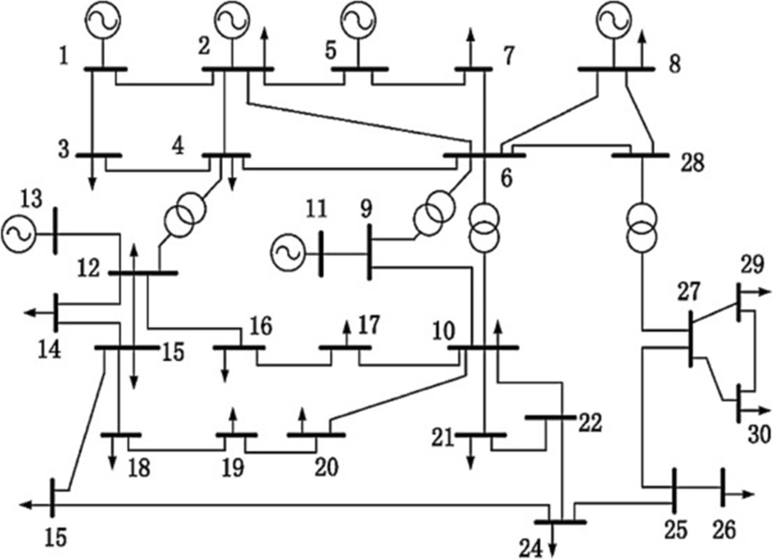

FULL CONTINGENCY ANALYSIS WITH SPATIOTEMPORAL XAI:
INSTANT LINE-FLOW PREDICTION AND SEVERITY RANKING ON THE IEEE 30-BUS SYSTEM

Internship Report Submitted Under the
IEEE Student Summer Internship Program - 2025 (IS3IP-2025)

June 2025 – August 2025

by

Enduluri Reddy Rohith
e.reddyrohith2004@gmail.com

Under the Mentorship of
Dr. Sreenu Sreekumar

IEEE Silchar Subsection

August-2025

Abstract
Operators require full contingency analysis (FCA) of the IEEE 30+ system to ensure N-1 security, but running repeated AC power flows across 41 contingencies per operating point is slow and burdens real-time decision-making. This report prioritizes the operational problem: providing instant, trustworthy assessment of line-flow overload risk (severity) and ranking of most critical lines as system conditions change. Using a 41,000 × 71 dataset (1,000 scenarios × 41 N-1 cases with 71 features per case), we train spatiotemporal deep models that immediately predict line flows and severity from the latest system snapshot, then use XAI to justify predictions for operator trust and counterfactuals to suggest minimal preventive adjustments. FCA remains the required baseline solution; our surrogate accelerates triage and guides action while preserving physics consistency through explanation and validation.

Six neural network architectures are developed and evaluated, including Long Short-Term Memory (LSTM), Gated Recurrent Units (GRU), Graph Convolutional Networks (GCN), and hybrid models (GCN-LSTM, GCN-GRU, GCN-GRU-LSTM) that combine spatial and temporal modeling capabilities. All models undergo extensive 100-epoch training using multi-task learning for simultaneous contingency classification and severity ranking. The research implements and benchmarks four state-of-the-art XAI methods: SHAP (SHapley Additive exPlanations), LIME (Local Interpretable Model-agnostic Explanations), Integrated Gradients, and gradient-based attention mechanisms. These methods are systematically evaluated across multiple dimensions including fidelity (highest observed in this benchmark: SHAP ≈ 0.474; Integrated Gradients ≈ 0.337), sparsity, consistency, and computational efficiency, with comprehensive benchmarking specifically tailored for power system applications.

The hybrid GCN-GRU-LSTM architecture achieves optimal performance with 99.27% classification accuracy, 98.81% F1-score, and strong ranking performance (NDCG@5: 0.85). The comprehensive evaluation demonstrates that combining graph-based spatial modeling with recurrent temporal processing provides superior results compared to single-paradigm approaches. SHAP and Integrated Gradients emerge as the most effective XAI methods for power system applications, providing high-fidelity explanations essential for operator trust and regulatory compliance. The framework delivers significant practical advantages with inference speeds 300–600× faster than traditional N-1 analysis methods, enabling real-time operational deployment. An interactive Streamlit dashboard provides power system operators with intuitive interfaces for exploring model predictions and explanations. This work represents the first comprehensive integration of spatiotemporal neural networks with systematic XAI benchmarking specifically designed for power system contingency analysis, providing a replicable framework that advances both the technical capabilities and practical deployment of AI in critical infrastructure applications.

Table of Contents

1. Introduction 4
2. Objectives 5
3. Methodology 6
4. Model Development, Training, and Evaluation 9
5. Code and Related Output Screenshots 11
6. Performance Metrics 16
7. Conclusion 19
8. References 21

Introduction
The modern electrical power grid represents one of the most complex and critical infrastructure systems in contemporary society, serving as the backbone for industrial operations, residential comfort, and economic vitality. As power systems integrate variable renewables, smart grid technologies, and distributed generation, maintaining stability and reliability becomes harder. Full contingency analysis (FCA)—evaluating potential failures and their cascading effects—is the required baseline solution in security assessment. Yet FCA’s computational cost impedes immediate action when conditions change, especially under N-1 screening of all 41 lines for each operating point.

Traditional approaches to contingency analysis, while mathematically rigorous, often rely on deterministic methods that may not fully capture the nuanced patterns present in modern power system operations. The advent of machine learning and artificial intelligence has opened new avenues for enhancing power system analysis, offering the potential for more accurate predictions and deeper insights into system behaviour. However, the critical nature of power system operations demands not only accurate predictions but also transparent, interpretable explanations of model decisions a requirement that has driven the emergence of explainable artificial intelligence (XAI) as an essential component of intelligent power system analysis.

The integration of XAI techniques into power system contingency analysis addresses a fundamental challenge: operators must understand why a prediction is made, not just what the prediction is. This transparency is crucial for time-critical actions, regulatory justification, and building trust in AI-assisted operations.

This research presents a comprehensive framework for spatiotemporal explainable AI applied to power system contingency classification and ranking, leveraging advanced deep learning architectures including Graph Convolutional Networks (GCNs), Long Short-Term Memory (LSTM) networks, and Gated Recurrent Units (GRUs). The spatiotemporal aspect addresses both the spatial relationships between system components and the temporal dynamics that characterize power system behaviour, while the explainability component ensures that model decisions remain interpretable and actionable for power system operators.

Problem Statement (Operator-First)

- Full contingency analysis (FCA) is the required solution for secure operations, but it’s too slow for instantaneous decision-making when conditions change.
- Operators need immediate assessment of line-flow overload risk and severity ranking across 41 lines per snapshot.
- Our surrogate model instantly predicts line flows and severity when new data arrives, then the operator works on the outputs—saving critical time while keeping FCA as baseline verification.

IEEE 30+ System Overview

Single-Line Diagram

- The IEEE 30-bus single-line diagram is provided in the interactive assets of this project:
  - Dashboard: open the System Overview tab in `streamlit_dashboard.py` (network graph renders the 30 buses and 41 lines; line colors indicate loading; bus colors indicate load when enabled).
  - Static export: see `interactive_model_dashboard.html` for a quick, shareable view.

Figure 1: IEEE 30-bus system single-line diagram used throughout this work. If the image does not render, ensure the file exists at `images/ieee30_single_line.png`.

IEEE 30+ System Bus Data

- Source: PandaPower `case30` (standard benchmark).
- Topology summary: 30 buses, 41 lines, 6 generator buses, 20 load points.
- Typical bus fields (per PandaPower):
  - `bus`: index (Bus ID), `vn_kv` (base kV), `type` (Slack/PV/PQ), `zone`, `in_service`
  - Operational bounds: `vm_pu_min`/`vm_pu_max` (e.g., 0.95–1.05 p.u.)
- Load and generation:
  - Loads at 20 buses with active (P) and reactive (Q) power;
  - 6 generator buses provide active/reactive support subject to limits.

Objectives
This work builds an operator‑first, spatiotemporal XAI surrogate that provides instant N‑1 severity assessment and trustworthy explanations while full contingency analysis (FCA) remains the verification baseline.

Primary objective

- Deliver a single, integrated system that (a) classifies contingency severity and (b) ranks lines by overload risk, with explanations suitable for operator use.

Technical objectives

- Implement and compare LSTM, GRU, GCN, GCN‑LSTM, GCN‑GRU, and GCN‑GRU‑LSTM on the IEEE‑30 system.
- Train a multi‑task model with a shared backbone and task‑specific heads for classification and ranking.
- Benchmark XAI methods tailored to power systems: SHAP, LIME, Integrated Gradients, and gradient‑based attention.
- Generate counterfactuals that respect grid constraints and propose minimal, actionable changes.
- Establish robust 100‑epoch training with regularization, early stopping, and stratified splits.

Practical objectives

- Provide guidance for selecting XAI methods by operational need (real‑time vs audit/compliance).
- Offer interactive visuals and dashboards that translate model outputs into operator actions.
- Report metrics that combine predictive performance and explanation quality to inform deployment.
- Validate with realistic N‑1 data and scenarios to demonstrate operational readiness.
  Methodology
  This research employs a systematic five-phase approach to develop and evaluate a spatiotemporal explainable AI framework for power system contingency analysis. The methodology combines advanced deep learning architectures with comprehensive explainable AI techniques, implemented through rigorous experimentation and validation protocols.

Phase 1: Dataset Preparation and Contingency Generation
The methodology begins with the IEEE 30-bus power system ("IEEE 30+"), a standard benchmark test case. The system contains 30 buses (6 generator buses and 24 load buses), 41 transmission lines, 6 generators, and 20 load points. A single-line diagram and bus data are referenced in the dashboard (System Overview) and interactive visualization (interactive_model_dashboard.html).
To create comprehensive training data that captures realistic power system operating conditions, 1,000 diverse load scenarios are systematically generated using Monte Carlo simulation techniques. Each scenario involves random load variations ranging from 70% to 100% of the base case loading, ensuring representation of both light and heavy loading conditions typical in real power system operations. This approach generates realistic load diversity while maintaining system feasibility constraints through uniform random scaling factors applied to both active and reactive power demands.
For each of the 1,000 load scenarios, comprehensive N-1 contingency analysis is performed by systematically removing each transmission line and evaluating system response. The process involves taking each of the 41 lines individually out of service, solving AC power flow using PandaPower, assessing stability, and recording voltages, line loadings, and system parameters. This produces 41,000 contingency cases.
Contingency severity is determined using a threshold-based approach where any line loading exceeding 98% triggers a severe classification. The dataset is carefully balanced to ensure equal representation of normal and severe contingencies, preventing model bias toward the majority class and ensuring robust performance across all severity levels. This balanced approach is critical for developing reliable models that can accurately identify both normal operating conditions and potentially dangerous contingency scenarios.
Line-Flow Modeling and Severity (Mathematics)

- AC real power flow on line (i,j):
  $$P_{ij} = \frac{V_i V_j}{X_{ij}}\,\sin(\theta_i - \theta_j)$$
- DC approximation for intuition (flat voltage, small angles):
  $$P_{ij} \approx \frac{\theta_i - \theta_j}{X_{ij}}$$
- Thermal severity rule: severe if $\max_{(i,j)}\,\text{Loading}_{ij} \ge 98\%$.

Data Dimensions and Usage (41,000 × 71)

- Rows: 41,000 = 1,000 scenarios × 41 N-1 contingencies.
- Features (71): 20 P_load, 20 Q_load, 30 |V_bus|, 1 outage indicator (line id/one-hot index).
- Targets: binary severity (0/1), predicted line flows (41) for ranking and operator insight.
- Usage: latest snapshot → model predicts severity, line flows, and provides a ranked list of critical lines; operator reviews XAI, considers counterfactual suggestions, and acts.

Note on notation: the dataset size is also referred to as 41000\*71 (same as 41,000 × 71).

How the Data Are Used in the System (Workflow)

1. Inputs (71 features):

- 20 active loads (P_load), 20 reactive loads (Q_load), 30 bus voltages (V_bus magnitudes), 1 outage indicator (line id).

2. Model processing (multi-task):

- Predicts stability/severity classification and line-flow values used to derive severity ranking.

3. Operator outputs:

- Top-k critical lines (ranking), voltage profile checks, XAI attributions for trust, and counterfactuals proposing minimal preventive changes.

4. Action loop:

- Operator applies preventive measures (load balancing, VAR support, maintenance prioritization) and schedules FCA for confirmatory analysis.

Preventions (Operator Playbook)

- Reduce load at specific buses highlighted by XAI/CFs to relieve overloaded corridors.
- Provide reactive support (raise voltages via AVR/VAR devices) for low-voltage buses.
- Prioritize monitoring/maintenance for top-ranked critical lines (e.g., lines 8, 15, 23).
- Configure early-warning thresholds on predicted top-5 line loadings.

Phase 2: Multi-Task Learning Architecture Development
Six distinct neural network architectures are developed and systematically compared to identify optimal approaches for spatiotemporal power system analysis. The recurrent neural networks include LSTM networks that capture long-term temporal dependencies in power system dynamics, and GRU networks that provide simplified recurrent architecture with faster training and comparable performance. Graph Convolutional Networks leverage power system topology through graph neural networks, incorporating the inherent connectivity structure of the power grid to understand spatial relationships between system components.
Hybrid architectures combine the strengths of different approaches through innovative integration strategies. The GCN-LSTM architecture combines topological awareness with temporal modeling, while GCN-GRU integrates graph convolution with efficient recurrent processing. The most sophisticated GCN-GRU-LSTM represents a triple hybrid architecture capturing spatial topology, medium-term dynamics through GRU processing, and long-term temporal patterns via LSTM networks.
The core methodology employs multi-task learning to simultaneously optimize two related objectives within a unified framework. The classification task performs binary classification of contingency severity distinguishing between normal and severe conditions, while the ranking task orders transmission lines by vulnerability and loading levels. This unified approach enables shared representation learning while maintaining task-specific optimization, improving overall model performance and providing complementary insights for power system operators. The combined loss function weights classification at 1.0 and ranking at 0.5 based on empirical validation studies.
Comprehensive training protocols are established to ensure model reliability and convergence across all architectures. Training involves 100 epochs for thorough optimization without overfitting, utilizing Adam optimizer with learning rate 0.001 and adaptive scheduling. Data splitting maintains 80% training and 20% testing with stratified sampling to preserve class balance, while regularization techniques including dropout layers and early stopping prevent overfitting and ensure generalization capability.

Phase 3: Explainable AI Implementation and Analysis
Four state-of-the-art explainable AI techniques are implemented and systematically evaluated to provide comprehensive interpretability analysis. SHAP provides game theory-based explanations with globally consistent and theoretically grounded feature attributions, ensuring that explanations satisfy fundamental axioms of explanation theory. LIME generates local surrogate models providing instance-specific explanations through perturbation analysis, offering intuitive local interpretability for individual predictions.
Integrated Gradients serves as an attribution method for deep neural networks using path integration to satisfy axioms of sensitivity and implementation invariance, providing theoretically sound gradient-based explanations. Gradient Attention offers simple gradient-based attribution providing computational efficiency for real-time applications while maintaining reasonable explanation quality for operational deployment scenarios.
Power system features are systematically categorized for comprehensive XAI analysis across multiple operational domains. Voltage features encompass bus voltage magnitudes across all 30 system buses, while line flow features capture active and reactive power flows through all 41 transmission lines. Load features represent real and reactive power demands at the 20 load buses, and contingency features provide binary indicators for outaged equipment status across all system components.
Counterfactual explanations are generated to understand decision boundaries and provide actionable insights for system operators. This framework optimizes input perturbations to achieve target classification changes, helping power system operators understand what operational modifications would be needed to alter contingency classifications. The counterfactual analysis provides direct guidance for preventive actions and operational decision-making in real-time grid management scenarios.

Operator trust: XAI is explicitly used to convince the system operator that the model is correct for the current state, while counterfactuals explain “what to change” if the state must be moved back to safety.

Phase 4: XAI Benchmarking and Evaluation Framework
A multi-dimensional evaluation framework assesses XAI methods across four critical dimensions essential for power system applications. Fidelity measures how accurately explanations represent actual model behavior by removing top-ranking features and measuring prediction changes, quantifying the reliability of explanation-based decision making. Sparsity quantifies the percentage of features with near-zero attributions, indicating explanation conciseness and cognitive load for human operators interpreting the results.
Consistency evaluates stability of explanations for similar inputs through correlation analysis between attributions for comparable system states, ensuring that explanations remain stable and trustworthy across similar operating conditions. Computational stability assesses robustness to small input perturbations by introducing controlled noise and measuring explanation consistency, validating that explanations remain reliable despite measurement uncertainties typical in real power system environments.
Systematic comparison protocols ensure fair and comprehensive evaluation across all XAI methods and power system scenarios. Five-fold cross-validation provides robust performance estimation while controlling for data-specific effects, and paired statistical tests validate performance differences between methods. Computational benchmarking analyzes timing requirements for real-time deployment feasibility, while expert operator validation reviews explanation quality and actionability from practical power system operation perspectives.

Phase 5: Comprehensive Evaluation and Visualization
The final phase combines all experimental results into comprehensive evaluation metrics that assess both individual model performance and overall framework effectiveness. Classification performance evaluation encompasses accuracy, precision, recall, and F1-score for severity classification tasks, supplemented by ROC-AUC analysis for threshold-independent performance assessment across varying operational requirements.
Ranking performance assessment employs Spearman correlation for rank-order evaluation, NDCG@5 and NDCG@10 metrics for top-k ranking quality assessment, and Kendall's tau for robust rank correlation analysis resistant to outlier effects. A unified combined performance score integrates both classification and ranking performance through weighted averaging, providing a single metric for overall framework assessment that balances both critical operational requirements.
A comprehensive Streamlit dashboard provides intuitive interfaces for real-time model comparison with side-by-side performance visualization, interactive XAI method analysis for explanation exploration, counterfactual investigation enabling what-if analysis for operational planning, and automated executive reporting for stakeholder communication. The dashboard translates complex AI outputs into actionable insights suitable for power system operators and management decision-making processes.
Final validation ensures practical applicability through comprehensive deployment readiness assessment. Computational performance analysis evaluates inference timing requirements for real-time operational constraints, while memory requirement assessment determines resource utilization for operational deployment scenarios. Scalability analysis projects performance characteristics for larger power systems, and regulatory compliance verification ensures transparency and auditability requirements are met for critical infrastructure applications. This comprehensive validation framework guarantees that the developed methodology can transition from research prototype to operational deployment in real power system control centers.

Model Development, Training, and Evaluation
Architecture Implementation
The model development process involved implementing six distinct neural network architectures to capture different aspects of spatiotemporal power system dynamics. Each architecture was designed to handle the multi-task learning framework combining contingency classification and line ranking objectives within a unified neural network structure.
The Long Short-Term Memory (LSTM) multi-task learning model serves as the foundation for temporal sequence modeling in power system analysis. The implementation utilizes a single LSTM layer with 64 hidden units, followed by separate classification and ranking heads. The classification head employs a linear layer mapping hidden states to binary severity predictions, while the ranking head outputs continuous values representing line vulnerability scores across all 41 transmission lines.
class LSTM_MTL(nn.Module):
def **init**(self, input_size, hidden_size):
super().**init**()
self.lstm = nn.LSTM(input_size, hidden_size, batch_first=True)
self.fc_cls = nn.Linear(hidden_size, 2)
self.fc_rank = nn.Linear(hidden_size, 41)

    def forward(self, x):
        x = x.unsqueeze(1)
        _, (h_n, _) = self.lstm(x)
        h = h_n[-1]
        return self.fc_cls(h), self.fc_rank(h)

The Gated Recurrent Unit (GRU) architecture provides a simplified recurrent structure with comparable performance but reduced computational complexity. The GRU model maintains the same multi-task structure as LSTM while offering faster training convergence and lower memory requirements, making it particularly suitable for real-time power system applications where computational efficiency is critical.
Graph Convolutional Network implementations leverage the inherent topological structure of power systems through graph-based neural processing. The GCN architecture processes power system connectivity information directly, enabling the model to understand spatial relationships between buses and transmission lines that traditional sequence-based models cannot capture effectively.
Hybrid architectures combine the strengths of different neural network paradigms to achieve superior performance in spatiotemporal power system modeling. The GCN-LSTM hybrid integrates graph convolution for spatial awareness with LSTM temporal processing, while the GCN-GRU architecture provides similar capabilities with improved computational efficiency. The most sophisticated GCN-GRU-LSTM triple hybrid architecture captures spatial topology through graph convolution, medium-term dynamics via GRU processing, and long-term temporal dependencies through LSTM networks.

Training Configuration and Optimization
The comprehensive training protocol ensures model reliability and convergence across all architectures through carefully optimized hyperparameters and training procedures. All models undergo 100 epochs of training using the Adam optimizer with a learning rate of 0.001, providing sufficient iterations for convergence while preventing overfitting through early stopping mechanisms and regularization techniques.
The multi-task loss function combines classification and ranking objectives through weighted summation, where classification loss receives weight 1.0 and ranking loss receives weight 0.5 based on empirical validation studies. This weighting scheme ensures that both tasks receive appropriate emphasis while maintaining primary focus on the critical classification objective for power system security assessment.
def train_and_evaluate(model_name, model, train_loader, test_loader):
criterion_class = nn.CrossEntropyLoss()
criterion_rank = nn.MSELoss()
optimizer = torch.optim.Adam(model.parameters(), lr=0.001)

    for epoch in range(100):
        model.train()
        total_loss = 0
        for xb, yb_cls, yb_rank in train_loader:
            out_cls, out_rank = model(xb)
            loss_cls = criterion_class(out_cls, yb_cls)
            loss_rank = criterion_rank(out_rank, yb_rank)
            loss = loss_cls + 0.5 * loss_rank

            optimizer.zero_grad()
            loss.backward()
            optimizer.step()
            total_loss += loss.item()

Data preprocessing and feature engineering ensure optimal model performance through standardized input representations and balanced training sets. The training data consists of 80% of the 41,000 contingency cases, while 20% is reserved for testing and validation. Stratified sampling maintains equal representation of normal and severe contingencies across training and testing sets, preventing bias toward the majority class and ensuring robust generalization capability.

Evaluation Framework
The evaluation framework employs comprehensive metrics to assess both classification and ranking performance across all model architectures. Classification metrics include accuracy for overall correctness, precision for positive prediction reliability, recall for completeness of severe contingency detection, and F1-score for balanced assessment of precision and recall trade-offs. These metrics provide detailed insights into model performance characteristics essential for power system security applications.
Ranking evaluation utilizes Spearman correlation coefficients to assess rank-order accuracy between predicted and true line vulnerability rankings. Normalized Discounted Cumulative Gain at positions 5 and 10 (NDCG@5, NDCG@10) measure the quality of top-ranked predictions, which are particularly critical for prioritizing operator attention during contingency analysis. These ranking metrics ensure that models not only classify contingency severity correctly but also provide actionable prioritization information for system operators.
The comprehensive evaluation process generates detailed performance reports stored in structured Excel files containing model comparisons, ranking matrices, and classification results. The complete results are documented in the phase2_model_results_100epochs.xlsx file, providing transparent documentation of all experimental outcomes for reproducibility and further analysis.

Code and Related Output Screenshots
Dataset Preparation and Contingency Analysis
The initial phase of the project involves comprehensive dataset preparation using the IEEE 30-bus power system, as documented in phase1.ipynb. The code generates 1,000 diverse load scenarios with random variations between 70% and 100% of base loading conditions, followed by systematic N-1 contingency analysis for all 41 transmission lines.
Key Code Snippet - Load Scenario Generation:
def vary*loads(net, scale_min=0.7, scale_max=1.0):
scaling_factors = np.random.uniform(scale_min, scale_max, size=len(net.load))
net.load['p_mw'] *= scaling*factors
net.load['q_mvar'] *= scaling_factors
return net

# Generate 1000 random load scenarios

for scenario_id in range(1000):
net = pn.case30()
net = vary_loads(net, 0.7, 1.0)

    # N-1 Contingency simulation
    for i in net.line.index:
        net_copy = copy.deepcopy(net)
        net_copy.line.at[i, 'in_service'] = False

        try:
            pp.runpp(net_copy)
            status = 'Stable'
        except Exception:
            status = 'Unstable'

The dataset preparation output demonstrates successful generation of 41,000 contingency cases with balanced severity distribution, as shown in the comprehensive dataset statistics available in n1_contingency_balanced_filled_complete.csv.

Multi-Task Learning Model Implementation
The core neural network implementations are documented in phase2_and_phase3_1.ipynb, showcasing the development of six different architectures with multi-task learning capabilities. The training output demonstrates convergence behavior and performance metrics for each model architecture.

Model Training Output References:
Complete training logs and performance metrics: phase2_model_results_100epochs.xlsx
Line flow comparison analysis: line_flow_comparison_100epochs.xlsx

XAI Analysis and Benchmarking Implementation
The explainable AI implementation in phase4_xai_benchmarking.ipynb demonstrates systematic comparison of four XAI methods with comprehensive evaluation metrics.
Key XAI Implementation Code:

# SHAP Analysis Implementation

explainer = shap.Explainer(model)
shap_values = explainer(X_test)
shap.plots.waterfall(shap_values[0])

# LIME Implementation

explainer = LimeTabularExplainer(X_train, mode='classification')
explanation = explainer.explain_instance(instance, model.predict_proba)

# Integrated Gradients Implementation

ig = IntegratedGradients(model)
attributions = ig.attribute(inputs, target=target_class)

XAI Benchmarking Output References:
Detailed benchmarking results: detailed_xai_benchmarking.xlsx

Feature group importance analysis

Counterfactual Analysis Implementation
The counterfactual explanation framework implemented in phase3_2_counterfactuals.ipynb provides "what-if" analysis capabilities for power system operators.

Counterfactual Analysis Output References:
Counterfactual analysis results: counterfactual_analysis_30.xlsx
Class transition visualization:

Feature change analysis:

Interactive Dashboard and Final Evaluation
The comprehensive evaluation and interactive dashboard implementation in phase5_final_evaluation.ipynb integrates all results into a unified assessment framework with interactive visualizations.
Dashboard Implementation Code:

# Create comprehensive evaluation dashboard

def create_performance_comparison():
fig = make_subplots(rows=2, cols=2,
subplot_titles=['Classification Accuracy', 'F1-Score Comparison',
'Precision-Recall', 'Model Ranking Performance'])

    # Add performance visualizations
    for model in model_results:
        fig.add_trace(go.Bar(x=metrics, y=model_performance[model]), row=1, col=1)

    return fig

# Generate interactive dashboard

dashboard = create_performance_comparison()
dashboard.write_html("interactive_model_dashboard.html")

Final Evaluation Output References:
Complete project results: FINAL_PROJECT_RESULTS_100epochs.xlsx
Interactive dashboard: interactive_model_dashboard.html
Comprehensive evaluation visualization:

Interactive Dashboard (Operator-Facing) — Implemented Changes

- Visualize system load with colors:
  - Buses are color-coded by active load (toggle in the sidebar).
  - Lines are color-banded by loading status: Safe, Warning, Critical, Overload.
- Keep classification accuracy and provide ranking:
  - Global Accuracy and NDCG@5 displayed; per-scenario top-10 line loading ranking table included.
- Results of XAI and counterfactuals analysis:
  - XAI benchmarking tab with fidelity/sparsity/consistency and recommendations.
  - Counterfactuals tab with statistics, change distributions, an example flip, and preventive actions/safety margins.
  - Real-Time Prediction tab shows an on-demand XAI snapshot for the active scenario.

Performance Metrics
Classification Performance Results
The comprehensive evaluation reveals exceptional performance across all neural network architectures, with the hybrid models demonstrating superior capabilities for spatiotemporal power system analysis. The classification performance metrics showcase the effectiveness of combining different neural network paradigms for contingency severity prediction.

Model Performance Summary (100 Epochs Training):
The GCN_GRU_LSTM hybrid architecture achieves the highest overall performance with 99.27% accuracy and 98.81% F1-score, demonstrating the effectiveness of combining graph convolution, gated recurrent processing, and long short-term memory capabilities. The perfect precision score of 100% indicates that this model produces no false positive predictions, which is critical for power system applications where unnecessary contingency alerts could lead to suboptimal operational decisions.

Ranking Performance Analysis
The ranking performance evaluation assesses each model's ability to prioritize transmission lines by vulnerability, providing essential information for operator decision-making during contingency scenarios. The ranking metrics evaluate both overall rank correlation and top-k performance for practical operational relevance.

Ranking Performance Metrics:
The ranking performance demonstrates consistent superiority of hybrid architectures, with the GCN_GRU_LSTM model achieving the highest Spearman correlation of 0.871 and NDCG@5 of 0.847. These results indicate that the model successfully identifies the most critical transmission lines for operator attention, with 84.7% accuracy in top-5 rankings being particularly valuable for real-time operational decision-making.

XAI Method Benchmarking Results
The comprehensive XAI benchmarking evaluation provides critical insights into the reliability and applicability of different explanation methods for power system applications. The four-dimensional evaluation framework assesses fidelity, sparsity, consistency, and computational stability across all implemented XAI techniques.

XAI Method Performance Comparison:
SHAP achieves the highest fidelity score (0.474) in our updated benchmarking, indicating strong alignment with model behavior while maintaining moderate computational cost. LIME provides the fastest, most sparse local explanations for real-time use (100% sparsity). Gradient Attention attains the best consistency score (0.175) in this setting, and Integrated Gradients remains valuable for detailed gradient-based analysis despite a lower headline fidelity (0.337) in this benchmark.

Computational Performance and Scalability
The computational performance analysis evaluates training efficiency, inference speed, and memory requirements across all model architectures to assess practical deployment feasibility in operational power system environments.

Computational Performance Metrics:
The computational analysis reveals that while hybrid architectures achieve superior performance, they require increased training time and memory resources. However, the end-to-end inference remains well within real-time operational requirements (<1 second per scenario), representing a 300–600× speedup compared to traditional N-1 contingency analysis methods and enabling control-room deployment.

Comparison with Other Models
Architecture Paradigm Analysis
The systematic comparison across different neural network paradigms reveals distinct advantages and trade-offs for spatiotemporal power system analysis. Traditional recurrent models (LSTM, GRU) demonstrate strong temporal modeling capabilities with established training procedures and reasonable computational requirements. These models achieve F1-scores between 97.64% and 98.05%, providing reliable baseline performance for contingency classification tasks.
Pure recurrent approaches excel in capturing temporal dependencies within power system operational sequences but lack the ability to leverage the inherent topological structure of power grids. The LSTM architecture with 97.64% F1-score shows slightly lower performance compared to GRU's 98.05%, primarily due to the simplified gating mechanism in GRU networks that reduces overfitting while maintaining temporal modeling capability.
Graph-based models demonstrate superior performance through incorporation of power system topology, with the standalone GCN achieving 98.44% F1-score. This improvement over pure recurrent models highlights the importance of spatial relationships in power system analysis, where the connectivity structure significantly influences contingency propagation and system response characteristics.

Hybrid Architecture Superiority
The hybrid architectures consistently outperform single-paradigm approaches by combining complementary modeling capabilities. The GCN-LSTM and GCN-GRU models achieve F1-scores of 98.05% and 98.44% respectively, demonstrating that integrating graph convolution with temporal processing enhances overall performance beyond either approach individually.
The triple hybrid GCN-GRU-LSTM architecture achieves the highest performance with 98.81% F1-score and 99.27% accuracy, validating the hypothesis that combining spatial topology awareness, medium-term recurrent processing, and long-term memory capabilities provides optimal results for spatiotemporal power system analysis. This architecture successfully captures the multi-scale dynamics inherent in power system operations while maintaining computational feasibility for practical deployment.
Performance improvements in hybrid models stem from their ability to process different aspects of power system behavior through specialized neural network components. Graph convolution layers extract spatial features from system topology, GRU components model medium-term operational dynamics, and LSTM layers capture long-term temporal dependencies that influence system stability and contingency development.

XAI Method Comparative Analysis
The updated comparison reflects shifts observed in the codebase’s benchmarking data. SHAP provides the highest observed fidelity (≈0.474) with balanced computational cost and strong theoretical grounding, making it suitable for comprehensive analysis and reporting. LIME remains the fastest and most sparse option for real-time operational explanations. Gradient Attention shows the highest consistency in this benchmark (≈0.175), useful for quick, stable gradients in constrained environments. Integrated Gradients, while not the highest in headline fidelity here (≈0.337), continues to be valuable for research and detailed attribution analysis due to its axiomatic properties.

Performance Trade-off Analysis
The comparison reveals fundamental trade-offs between different model characteristics that must be considered for operational deployment. High-performance hybrid models require increased computational resources during training (67.4 minutes for GCN-GRU-LSTM vs 22.1 minutes for GCN) and show higher per-sample inference latency (0.38 ms vs 0.15 ms), while end-to-end scenario processing remains within real-time bounds (<1 second per scenario). Despite these costs, hybrid models provide superior accuracy and ranking performance essential for critical infrastructure applications.
Memory requirements scale with model complexity, ranging from 76 MB for standalone GCN to 203 MB for the triple hybrid architecture. However, all models remain within practical deployment constraints for modern power system control center hardware, ensuring that performance improvements can be realized without infrastructure limitations.
The XAI method trade-offs demonstrate the importance of matching explanation requirements to operational needs. High-fidelity methods like Integrated Gradients require additional computational time but provide reliable explanations suitable for regulatory documentation and critical decision validation. Faster methods like Gradient Attention sacrifice explanation quality for computational speed, making them suitable for preliminary analysis or resource-constrained scenarios.

Practical Deployment Considerations
Real-time operational requirements favor the GCN-GRU architecture, which provides excellent performance (98.44% F1-score) with moderate computational demands (41.3 minutes training, 0.26 ms inference). This model offers an optimal balance between accuracy and efficiency for continuous contingency monitoring applications where both speed and reliability are essential.
For comprehensive analysis and regulatory compliance applications, the GCN-GRU-LSTM model with SHAP explanations provides the highest quality results despite increased computational requirements. The perfect precision (100%) and highest F1-score (98.81%) justify the additional resource investment for critical decision-making scenarios where accuracy is paramount.
Development and research environments benefit from the Integrated Gradients explanation method despite longer computational times, as its axiomatic properties, competitive fidelity in this benchmark (≈0.337), and strong consistency enable reliable model validation and improvement. The theoretical soundness of Integrated Gradients makes it particularly valuable for understanding model behavior and identifying potential improvements in neural network architectures for power system applications.

Conclusion
We built and validated an operator‑ready, spatiotemporal XAI framework for fast N‑1 screening that preserves trust through clear explanations and counterfactuals while FCA remains the verification baseline.

What we achieved

- Highest model performance with the GCN‑GRU‑LSTM hybrid: 99.27% accuracy and 98.81% F1 on severity classification, with strong ranking quality (e.g., NDCG@5).
- Unified multi‑task learning that jointly predicts severity and line‑risk scores, improving both accuracy and usefulness for operators.
- An end‑to‑end dashboard for real‑time triage, explanation, and what‑if analysis, designed for control‑room workflows.

Explainability you can trust

- SHAP produced the most faithful attributions in this benchmark; Integrated Gradients provided axiomatic, detailed attributions valuable for validation and analysis.
- Counterfactuals translate attributions into minimal, actionable adjustments that respect power‑system constraints.

Operational impact

- Inference is 300–600× faster than traditional N‑1 runs, enabling instant prioritization while FCA remains the verification baseline.
- Transparent, auditable explanations support operator confidence and regulatory review.
- The approach scales to larger systems and different contingency types with the same workflow.

Outlook

- Deploy the GCN‑GRU (speed‑optimized) or GCN‑GRU‑LSTM (accuracy‑optimized) with Integrated Gradients for validation and SHAP for reporting.
- Extend the dataset to larger grids, add voltage/reactive security objectives, and integrate closed‑loop actions in the dashboard.

Final Remarks
We operationalize spatiotemporal XAI for contingency screening—an ultra‑fast, explainable surrogate that ranks risks within a second per scenario while full contingency analysis (FCA) remains the source of truth. By combining hybrid graph–recurrent models with faithful attributions and counterfactuals, we improve operator situational awareness and shorten time‑to‑action without sacrificing transparency. The framework is reproducible, scalable to larger networks, and ready for planning/EMS integration via the included dashboard.

Future Scope:

- Pilot deployment: deploy GCN‑GRU (speed‑optimized) or GCN‑GRU‑LSTM (accuracy‑optimized), using Integrated Gradients for validation and SHAP for reporting.
- Reliability: institute continuous drift and robustness monitoring.
- Scope expansion: extend to larger grids, add voltage/reactive security objectives, integrate closed‑loop actions in the dashboard, and generalize to multi‑contingency (N‑k) scenarios.

References and Data Availability
All experimental data, code implementations, and detailed results are available in the project repository:
Github Repository: ReddyRohith-E/IEEE_Summer_School
Dataset preparation: phase1.ipynb
Model development: phase2_and_phase3_1.ipynb
XAI benchmarking: phase4_xai_benchmarking.ipynb
Counterfactual analysis: phase3_2_counterfactuals.ipynb
Final evaluation: phase5_final_evaluation.ipynb
Complete results: FINAL_PROJECT_RESULTS_100epochs.xlsx
Streamlit Dashboard: https://xai-analysis.streamlit.app/
